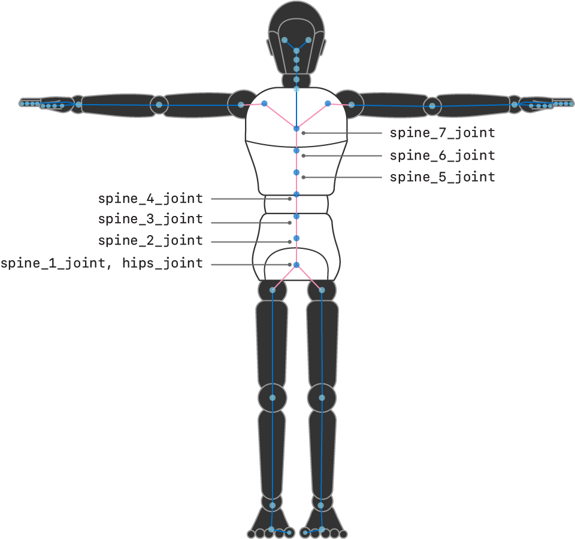
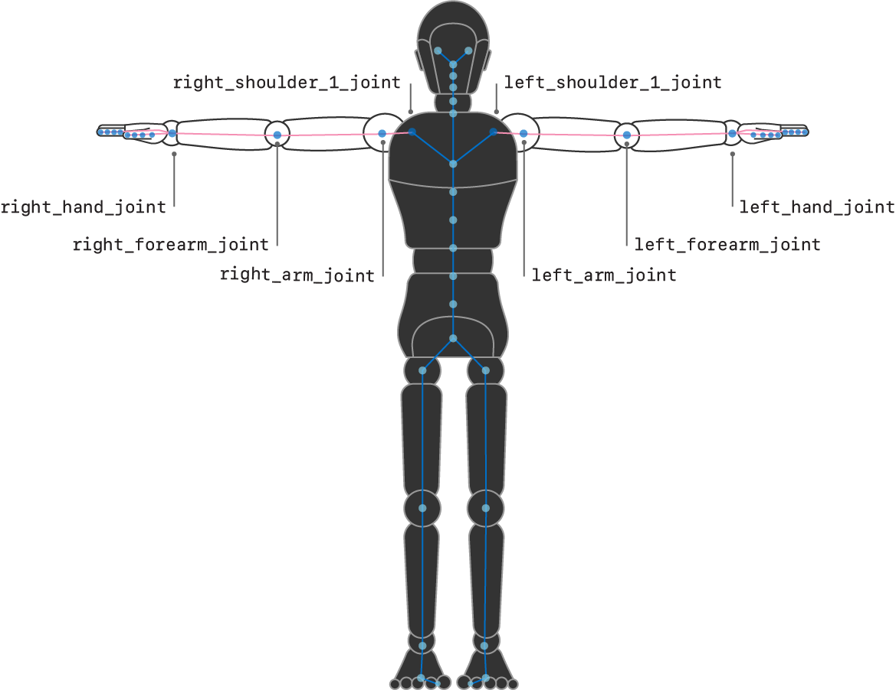
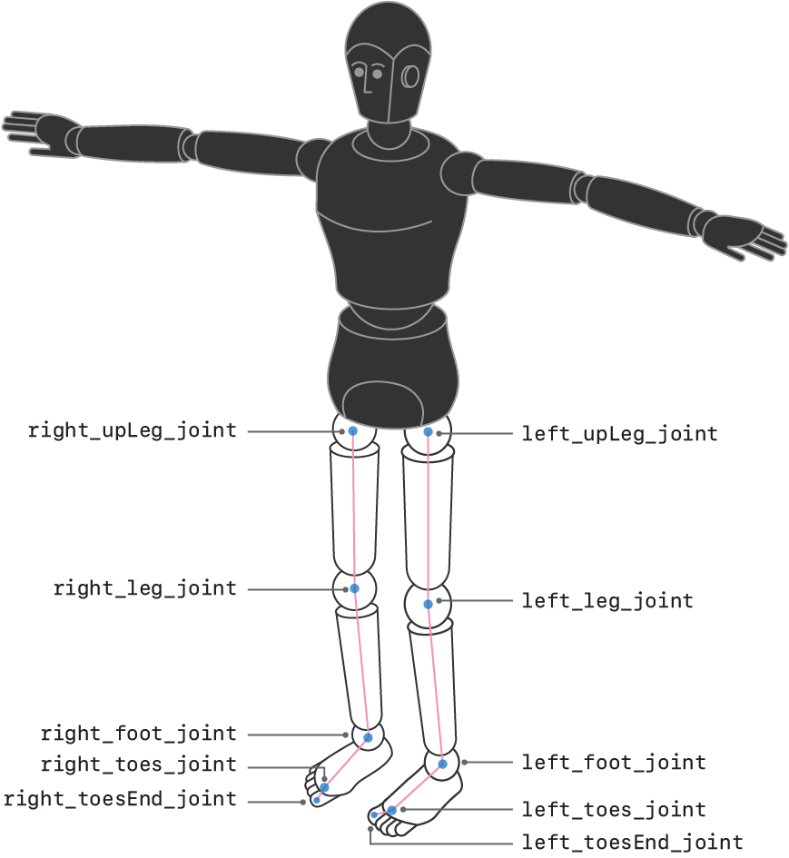
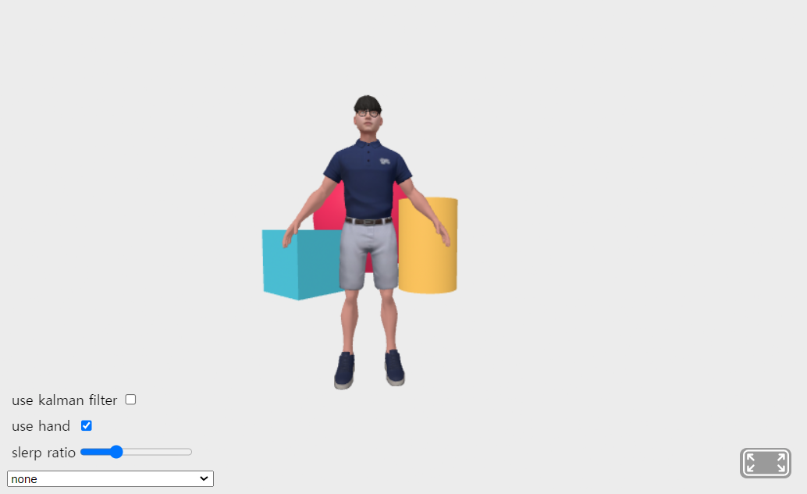

# Introduction
- This is a framework for the avatar puppeting with mediapipe holistic tracking.
- This project is originally for implementing the WXR body tracking feature. [More information about WXR](https://www.wxr.onl/)
- Mediapipe is a body-tracking framework developed by Google. [More information about mediapipe](https://developers.google.com/mediapipe)
## Demonstration

## Motivation of this project
- Basically, Mdiapipe holistic tracking offers only the position of the landmarks, not the transformation of each bone. Therefore implementing avatar puppeting with mediapipe requires additional calculation transforming from landmark positions to rotation of each avatar bone. 
- In contrast, ARKit body tracking offers the transformation matrix of each bone, not requiring additional calculation. This project also provides avatar puppeting framework with ARKit body tracking, not so much calculation included. <a href="https://developer.apple.com/documentation/arkit/arkit_in_ios/content_anchors/validating_a_model_for_motion_capture">More information about ARKit</a> 
- There's already a similar project using mediapipe to control avatar: Kalido Kit. Below is the demonstraion of Kalido Kit. To run it, check this link. [Kalioface](https://3d.kalidoface.com/)

- But this project is for v-tubers, so it first aims to provide seamless avatar control with tracking, compromising the exact tracking of the full-body pose.
- On the other hand, this project aims to provide exact tracking of the full body pose to implement human body digital tween on the workspace of WXR, compromising seamless avatar control.

# How to run
1. Execute `npm run` on the terminal.
2. Access `localhost:8080` on Chrome browser.

# How to use
## User interface
</img>
- use Kalman filter: Activate Kalman filter to remove noise from the avatar pose.
- use hand: Activate hand tracking.
- slerp ratio: Every time a new bone rotation is calculated, it's slerped (spherically linear interpolated). If slerp ratio is 0.3, only 30% of the new rotation is effective. If slerp ratio is too low, the avatar is slow so that it can't catch up the fast movement.
- slider: Choose the video source for meidapipe holistic tracker. Once the option is chosen, the slider deactivates.
