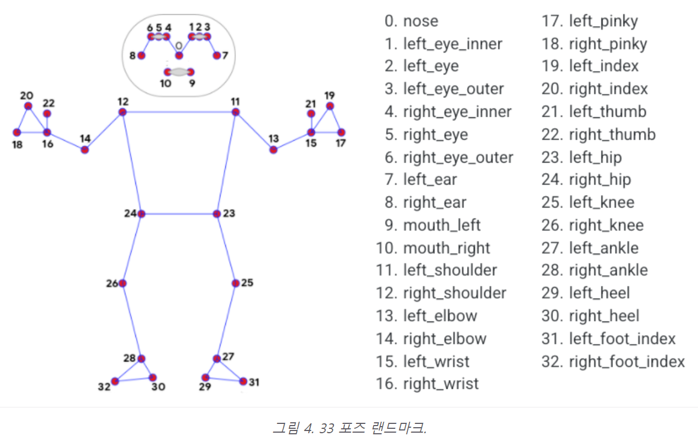
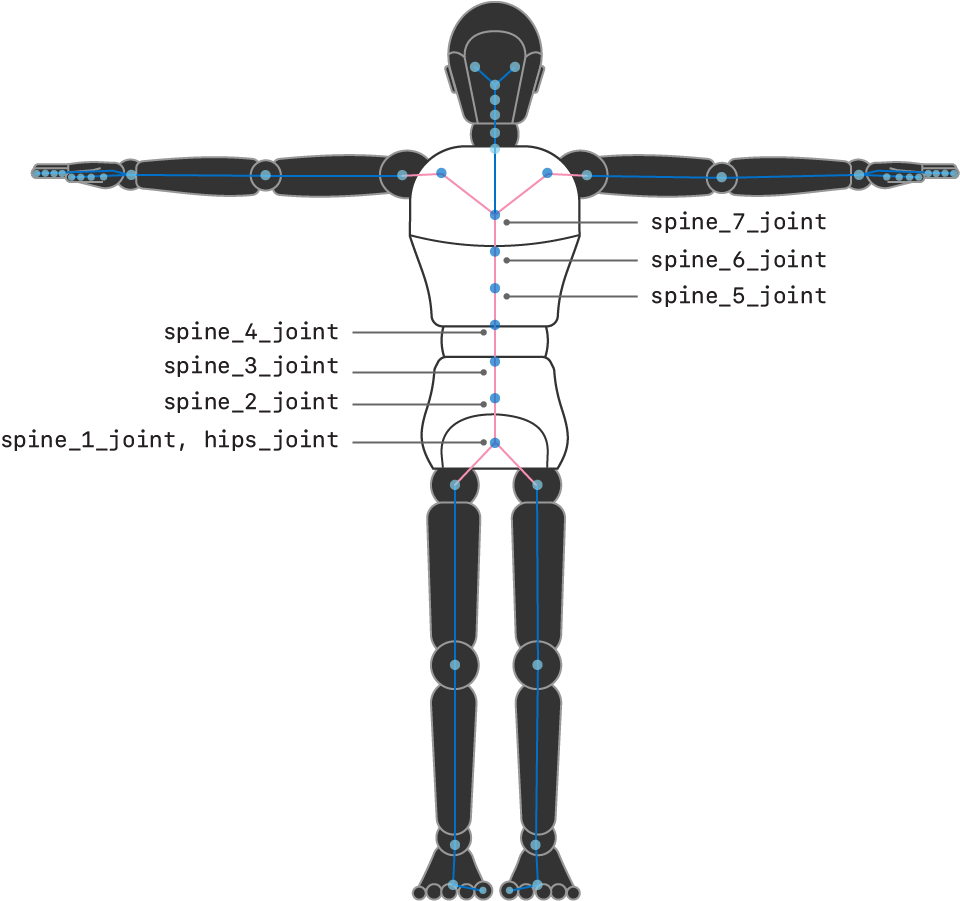
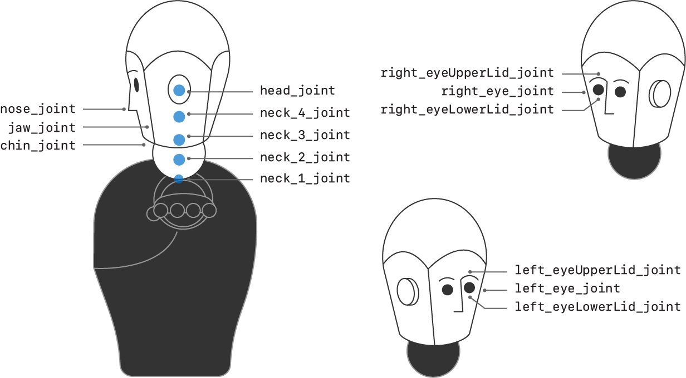
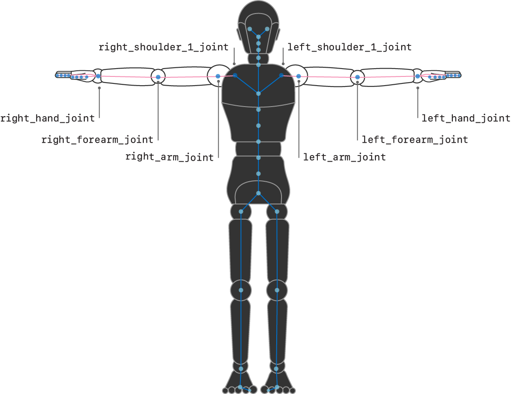
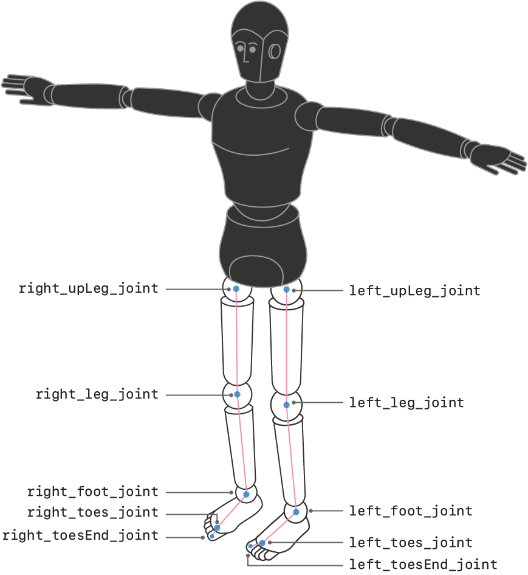
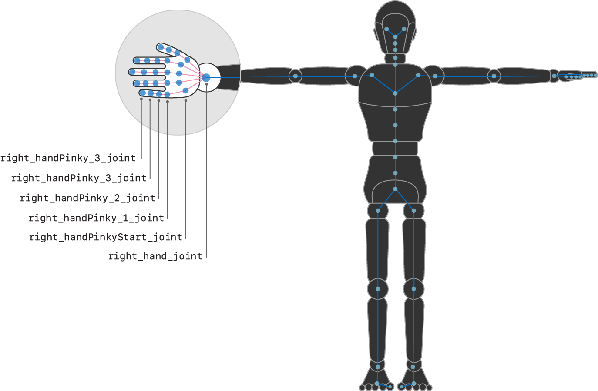
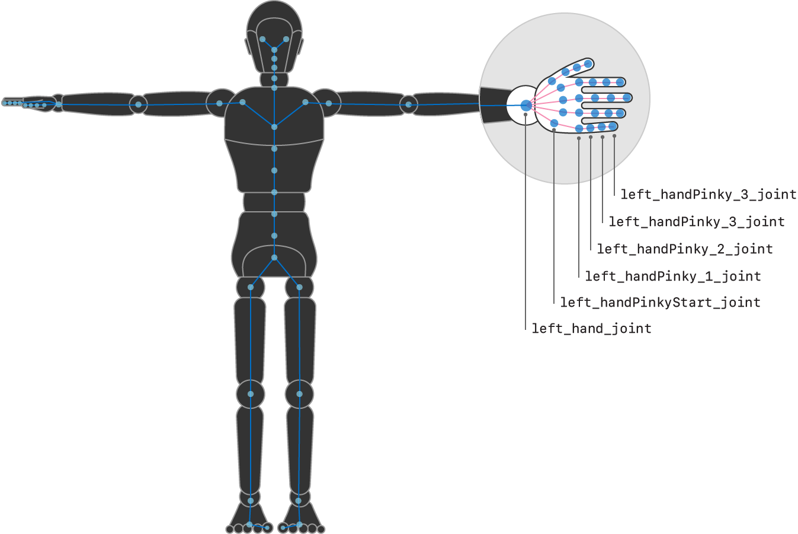
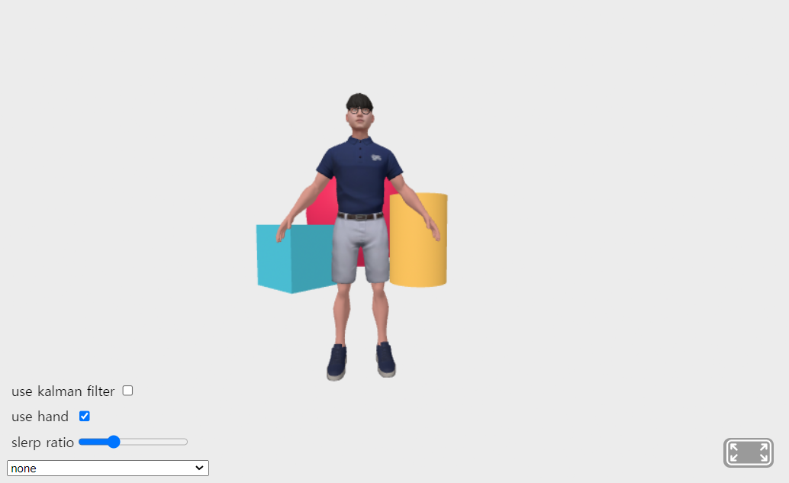

# Introduction
- This is a framework for the avatar puppeting with mediapipe holistic tracking.
- This project is originally for implementing the WXR body tracking feature. [More information about WXR](https://www.wxr.onl/)
- Mediapipe is a body-tracking framework developed by Google. [More information about mediapipe](https://developers.google.com/mediapipe)
- 
Basically, Mdiapipe holistic tracking offers only the position of the landmarks, not the transformation of each bone. Therefore implementing avatar puppeting with mediapipe requires additional calculation transforming from landmark positions to rotation of each avatar bone.

- 
In contrast, ARKit body tracking offers the transformation matrix of each bone, not requiring additional calculation.
<a href="https://developer.apple.com/documentation/arkit/arkit_in_ios/content_anchors/validating_a_model_for_motion_capture">More informations about ARKit</a> 
- There's already a similar project using mediapipe to control avatar: Kalido Kit. Check this link. [Kalioface](https://3d.kalidoface.com/)
- But this project is a v-tuber tracking application with Mediapipe, so it does not aim to provide exact tracking of the full body pose. It's enough to provide v-tubers with face and upper-body tracking.
- On the other hand, this project aims to provide exact tracking of the full body pose to implement human body digital tween on the workspace of WXR.

# How to run
1. Execute `npm run` on the terminal.
2. Access `localhost:8080` on Chrome browser.

# How to use

- use Kalman filter: Activate Kalman filter to remove noise from the avatar pose.
- use hand: Activate hand tracking.
- slerp ratio: Every time a new bone rotation is calculated, it's slerped (spherically linear interpolated). If slerp ratio is 0.3, only 30% of the new rotation is effective.
- slider: Choose the video source for meidapipe holistic tracker. Once the option is chosen, the slider deactivates.
